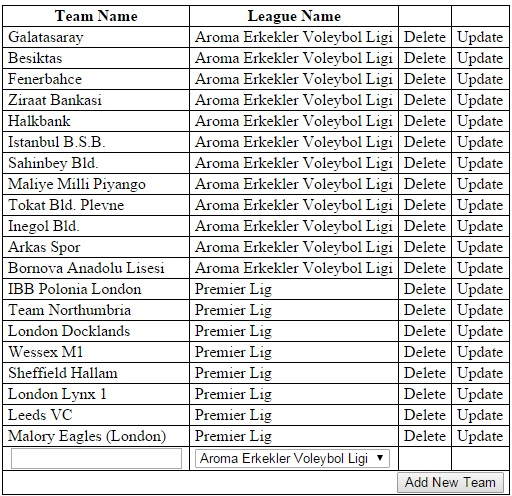
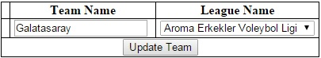
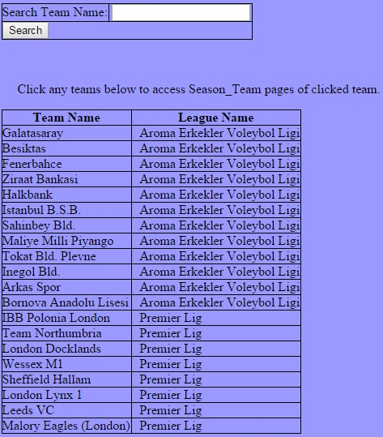
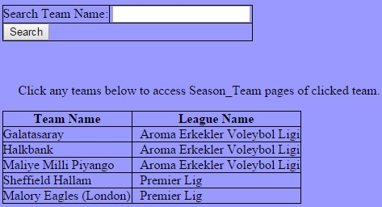
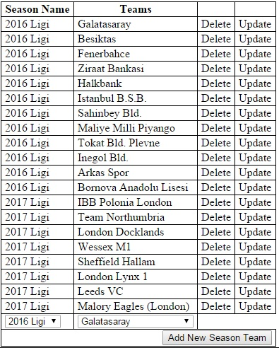
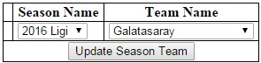
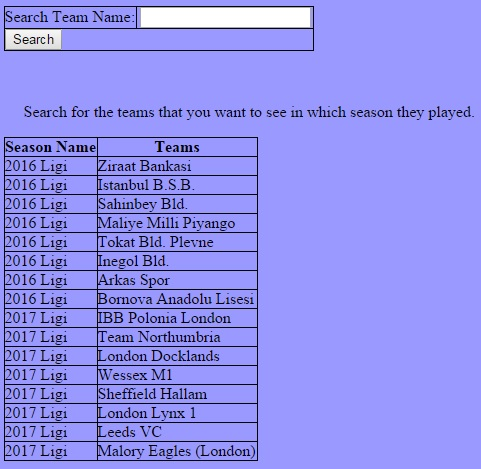
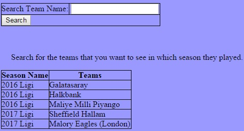
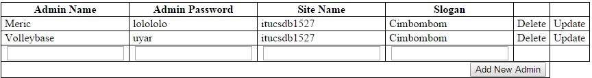
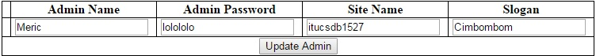

Parts Implemented by Meriç Turan
================================

General View
------------

|
Update, delete and insert features are not given to users. These features are only for admins.

Users can search and list for teams and season teams relationship.

|

Teams
-----

**Admin Panel**

|
Admins can do delete, update and insert operations.

A screenshot from Admin Panel for teams can be seen below.

|

|
When team name is written and league name is selected via selection box and "Add New Team" is clicked, new team is inserted.

When delete is clicked, selected row is deleted.

When update is clicked, the page below is opened and new team name is written and league name is selected via selection box. After that, "Update Team" will be clicked and update operation occurs.

|

**User Panel**

|
Initially all teams are listed and users can search for any team they want.

Team names and league names of teams are listed.

When any team name is clicked, season team relationship page is opened.

Teams page is seen as below from user's perspective.

|

|
When "al" is searched, it searches for the teams that has "al" in their names and the page which is seen below is opened.

|

Season Team
-----------

**Admin Panel**

|
Admins can do delete, update and insert operations.

A screenshot from Admin Panel for teams can be seen below.

|

|
When season name and team name are selected via selection box and "Add New Season Team" is clicked, new season team is inserted.

When delete is clicked, selected row is deleted.

When update is clicked, the page below is opened and new season name and team name are selected via selection box. After that, "Update Season Team" will be clicked and update operation occurs.

|

**User Panel**

|
Initially all seasons and teams are listed and users can search for any team they want.

Season names and team names of seasons are listed.

Season team page is seen as below from user's perspective.

|

|
When "al" is searched, it searches for the teams that has "al" in their names and the page which is seen below is opened.

|

Admin Information
-----------------

**Admin Panel**

|
Admins can do delete, update and insert operations.

A screenshot from Admin Panel for admin informations can be seen below.

|

|
When admin name, admin password, site name and slogan are written and "Add New Admin" is clicked, new admin is inserted.

When delete is clicked, selected row is deleted.

When update is clicked, the page below is opened and new admin name, new admin password, new site name and new slogan are written. After that, "Update Admin" will be clicked and update operation occurs.

|

