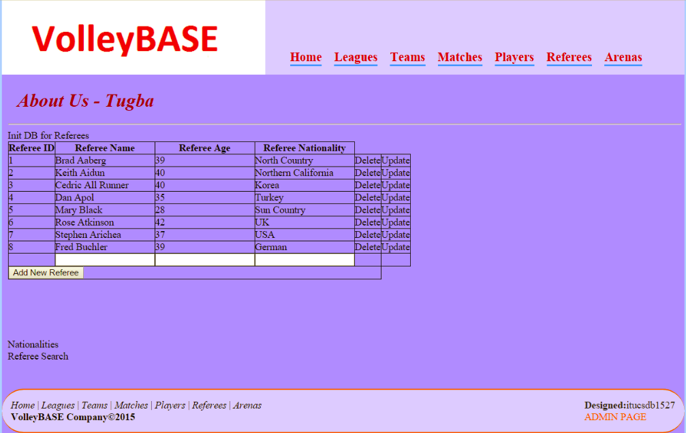
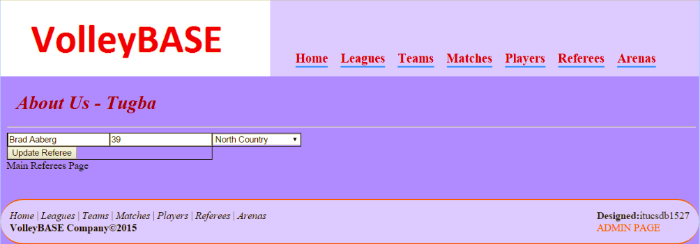
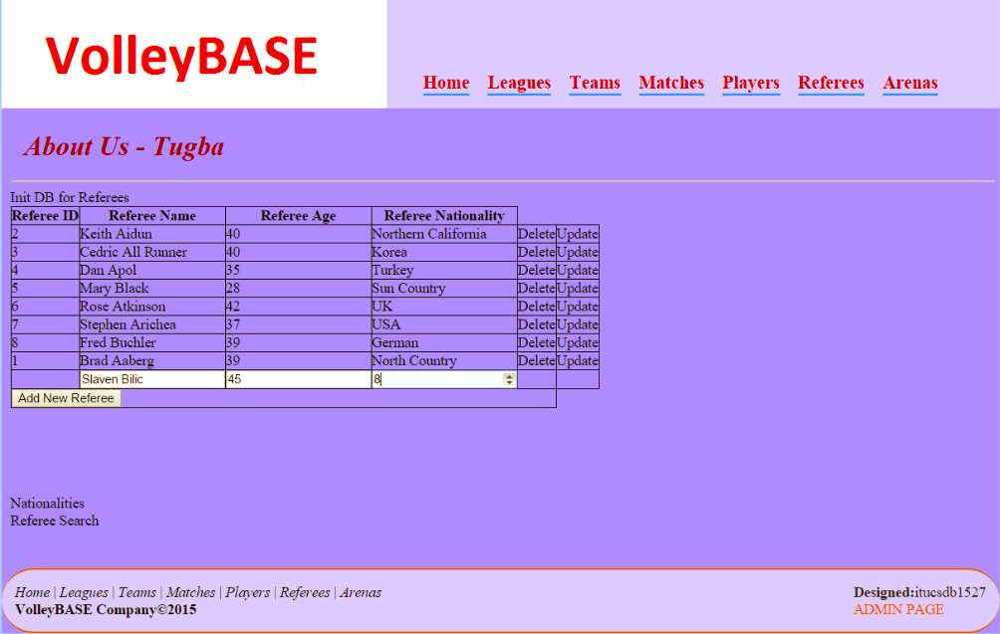
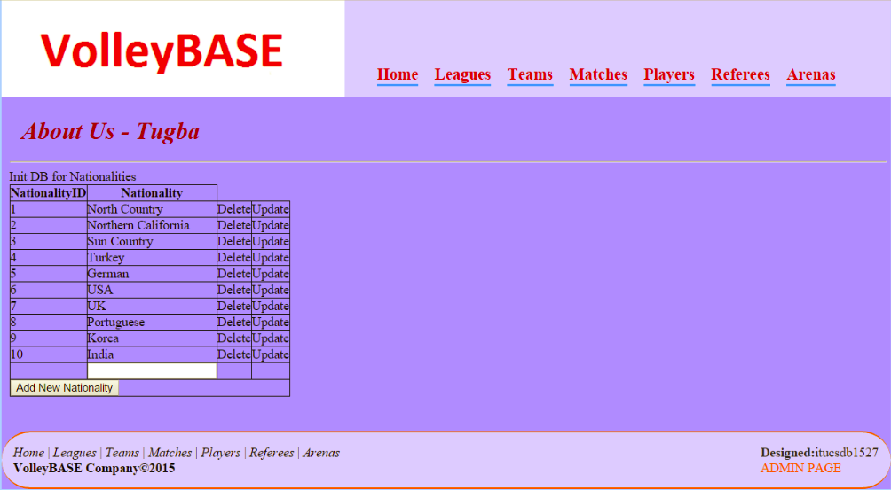
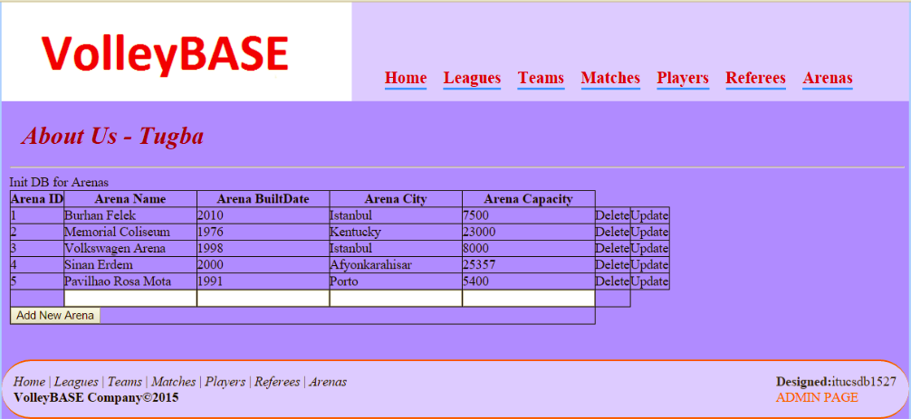
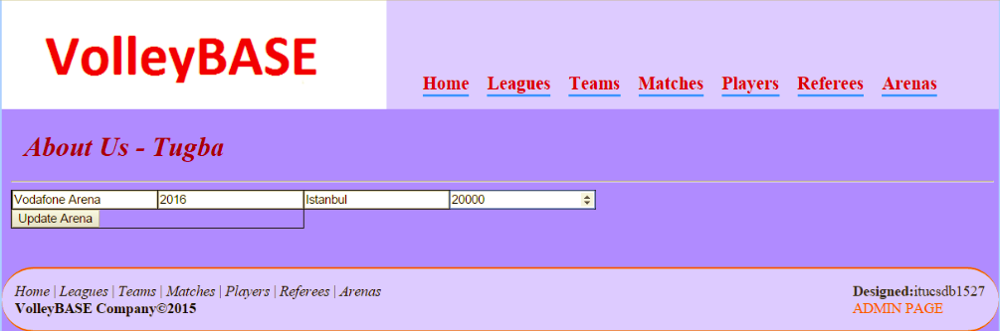

Parts Implemented by Tugba Ozkal
================================

General Wiev
------------

|
In this section, there are three main tables which includes add, delete, update functions. Two of them, referee and nationality, are connected to each other.
|

Referee
-------

|
Referee table has four attributes. These attributes are referee's basic features such as his/her name, age and nationality.
For each referee, there is a unique number which is designated by the system, that is ID.
The table of referees can be seen in the figure 5.1.1.
|

   figure 5.1.1

|
To update a tuple, user should click to 'update' button (figure 5.1.1). After that, another window (figure 5.1.2) which includes many boxes to enter new information will be opened.
|

   figure 5.1.2

|
To add a new referee, user should enter new features into the boxes under the table and then he/she should click to 'add new referee'
button as can be seen in the figure 5.1.3.
|

   figure 5.1.3

|
To delete a referee, user should click to 'delete' button which is located at row of the related referee (figure 5.1.1).
|

Nationality
-----------

|
Nationality table just includes countries. This table sends the attributes to referees. Each country has a unique number which is assigned
by the system, that is ID.
Nationality table can be seen in the figure 5.1.4.
|

   figure 5.1.4

|
As seen in the figure 5.1.4, nationalities can be updated or deleted clicking buttons. And, new nationality can be added by the same way.
|

Arena
-----

|
Arena table includes five attributes such as the name, the built date, the city and the capacity. Each arena also has a unique number, that is ID.
Arena table can be seen in the figure 5.1.5.
|

   figure 5.1.5

|
As seen in the figure 5.1.5, arenas can be updated or deleted clicking buttons. And, new arena can be added by the same way.
Search page can be seen in the figure 5.1.6.
|

   figure 5.1.6
